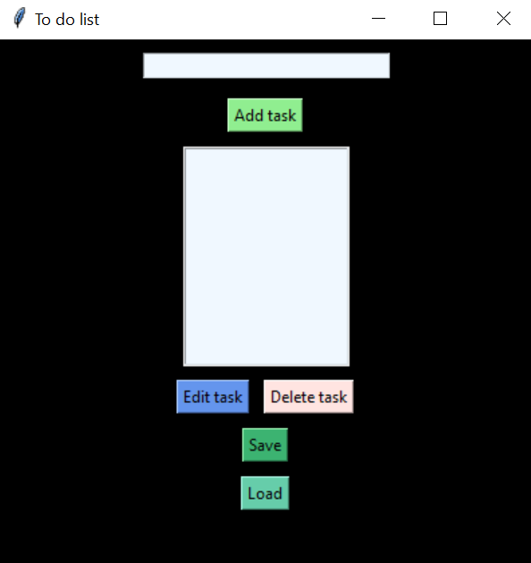

# To-Do List Application

This is a simple To-Do List application built with Python's `tkinter` library. The application allows users to add, edit, delete, save, and load tasks.

## Features

- Add new tasks
- Edit existing tasks
- Delete tasks
- Save tasks to a file
- Load tasks from a file

## Requirements

- Python 3.x
- `tkinter` library (included with Python standard library)

## Installation

1. Clone the repository:
   ```bash
   git clone https://github.com/AnnaKupyniak/To-do-list.git
   ```
## Usage

### Navigate to the project directory:

```bash
cd To-do-list
python main.py
```
The application window will open. You can add tasks by typing in the input box and clicking "Add task".
To edit a task, select it from the list, type the new task in the input box, and click "Edit task".
To delete a task, select it from the list and click "Delete task".
To save your tasks to a file, click "Save" and choose a location to save the file.
To load tasks from a file, click "Load" and select a file containing your tasks.

## File Structure
   main.py: The main script to run the application.
   todo.py: Contains the ToDoListApp class with all the application logic.

Example
